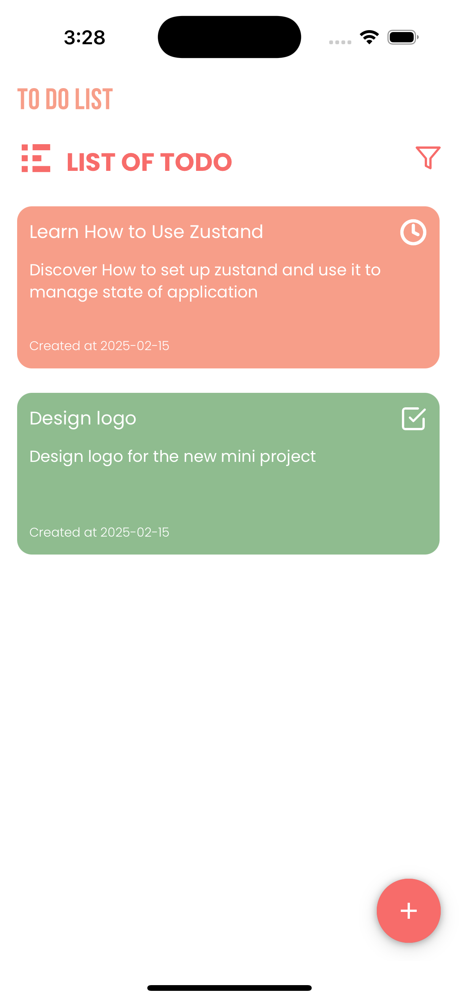

# Todo App with React Native and Expo

A simple Todo app built with **React Native**, **Expo**, and **Zustand** for state management. This project was created to learn and explore modern tools for building mobile applications.

## Screenshots

## Features
- Add, Edit, Delete, filter, and complete tasks.
- Data persistence using **Async Storage**.
- Clean and responsive UI with **React Native Paper**.
- Built with **TypeScript** for type safety and better developer experience.
- Responsive design using **React Native Size Matters**.

## Tech Stack
- **React Native**: For building cross-platform mobile apps.
- **Expo**: For rapid development and testing.
- **Zustand**: Lightweight state management.
- **TypeScript**: For type-safe code.
- **React Native Paper**: For a polished and customizable UI.
- **React Native Size Matters**: For handling responsiveness.
- **Async Storage**: For local data persistence.

## Getting Started

### Prerequisites
- Node.js (v16 or higher)
- Expo CLI (install globally using `npm install -g expo-cli`)
- Git

### Installation
1. **Clone the repository**:
   `git clone https://github.com/haris-0525/TodoApp.git`
   `cd TodoApp`
2. Install dependencies:
 `npm install`
3. Start the development server:
 `npm start`
4. Open the app on your device:
   Scan the QR code with the Expo Go app (available on iOS and Android).
   Alternatively, run on an emulator
   `npm run android` or on simulator `npm run ios`

## Contributing
Contributions are welcome! If you'd like to contribute, please follow these steps:

1. Fork the repository:
 `git clone https://github.com/haris-0525/TodoApp.git`
 `cd TodoApp`
3. Create a new branch:
`git checkout -b feature/your-feature`
4. Commit your changes: 
`git commit -m 'Add some feature'`
5. Push to the branch:
`git push origin feature/your-feature`
6. Open a pull request.

## Acknowledgements
1. Expo for the amazing development tools.
2. Zustand for lightweight state management.
3. React Native Paper for the beautiful UI components
4. React Native Size Matters for handling responsiveness.
5. Async Storage for local data persistence.

Made with ❤️ by Haris Amjad
